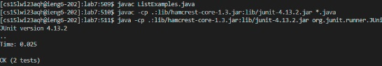

# Lab Report 4
Kenneth Nguyen, PID A17458399, B270 Thursday 10AM

## Step-by-Step of reproducing the Competition on your own

**1. (SETUP) Initially delete the repository from my GitHub**

**2. (SETUP) Fork the Repository to my personal GitHub account**

> Shown above, the the repo is is about to be forked.

> Shown above, the the repo is forked to my account.

**3. Start the timer! Logging into ieng6 using my personal remote computer, cse15laqh**

> Shown above; no passwod is needed to log in after my ssh file because we added the key to my .ssh local computer.

**4. Remove the lab7 directory previously cloned**

> Shown above, we `cd ~` to go to home, ls to see the file, remove using `rm -rf` the directory, then ls again to show that we've deleted the directory `lab7`

**5. Clone the repository from GitHub**

> Reclone the directory with `git clone <path>:`, <path> provided in screenshot via SSH tab. The screenshot shows the directory being cloned locally.

**6. Run the code, demonstrating it fails. Then, edit the code to fix the failing test.**

- Type in these commands to list the files, change directory, and again list the files:
`<ls><cd lab 7><ls>`
- `javac ListExamples.java` to compile ListExamples
- `javac -cp .:lib/hamcrest...` to compile the JUnit tester, copy + paste command from Lab3.
- `java -cp .:lib/hamcrest...` to run the JUnit tester.

> Shown in the screenshot, the JUnit runner code fails.

To debug, run `nano` on the file and fix the bug that you've located.

> On your keyboard, press the <down-arrow> key however many times it requires to get to the bottom of the program, and change the last index1 to index2, using <right-arrow> key as shown where the cursor is, shown on the screenshot below.

> From the screenshot above: After changing the bug at the cursor (index2), hit <CTRL-O>, <ENTER>, and <CTRL-X> to save and exit.

**7. Run the tests, demonstrating that they now succeed**
- To do this, run
  - `<up><up><up><up><enter>` → `javac ListExamples.java`
  - `<up><up><up><up><enter>` → `javac -cp .:lib/hamcrest-core-1.3.jar:lib/junit-4.13.2.jar *.java`
  - `<up><up><up><up><enter>` → `java -cp .:lib/hamcrest-core-1.3.jar:lib/junit-4.13.2.jar org.junit.runner.JUnitCore TestListExamples`
- Since the commands followed by the arrows → were 4 up commands up, hit the <up> arrow key 4 times and hit enter to recompile and re-execute the code.

  

> The screenshot above demonstrates the recompiling and re-executing. Now, the code runs, as shown by the `OK (2 tests)`

**8. Commit and push the resulting change to your GitHub account**
- To commit and push the code to GitHub, run the following three commands, also demonstrated in the screenshot.
  - `git add *`
  - `git commit -m "debugged ListExamples.java"`
  - `git push`
  

> As the screenshot shows, the git push succeeded.

## The END!
This is the end of the tutorial by Kenneth Nguyen
