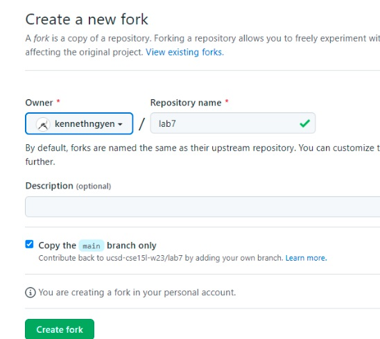

# Lab Report 4
Kenneth Nguyen, PID A17458399, B270 Thursday 10AM

## Step-by-Step of reproducing the Competition on your own

1. (SETUP) Initially delete the repository from my GitHub

2. (SETUP) Fork the Repository to my personal GitHub account

> Shown above, the the repo is is about to be forked.

> Shown above, the the repo is forked to my account.

3. 
