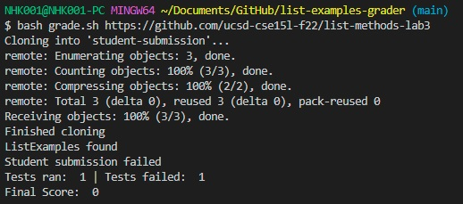
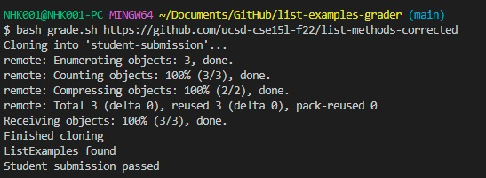
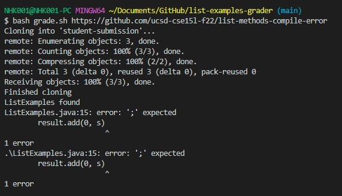
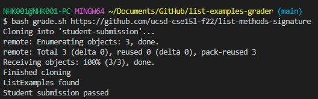
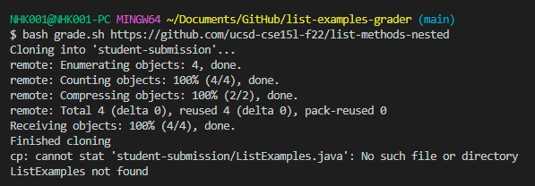
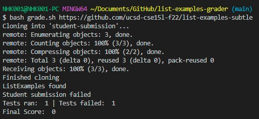

# Lab Report 5, by Kenneth Nguyen PID A17458399
**For this Lab Report, I will be demonstrating that my `grade.sh file` works on the exmaple repositories provided in *Week 6 Lab Write-up*.**

## 1. Default Example provided in the original repository with logic error

> Catches bugs as it should

## 2. Corrected Student Submission that gets *FULL PASS*

> Succeeds as expected

## 3. Ran on Compile Error: prints there was a compile error based on Syntax.
`https://github.com/ucsd-cse15l-f22/list-methods-compile-error`

> Catches compile error as it should

## 4. Ran on list-methods-signature, which passes the Test file provided.

> Succeeds as expected

## 5. Ran on list-methods-nested, which fails because it is in a different directory and can't be found.

> Catches bugs as it should

## 6. Ran on list-examples-subtle, which fails because the comparison made is with == rather than .equals().

> Catches bugs as it should

# The End. This shows that my Grade.sh file works.
Kenneth Nguyen
